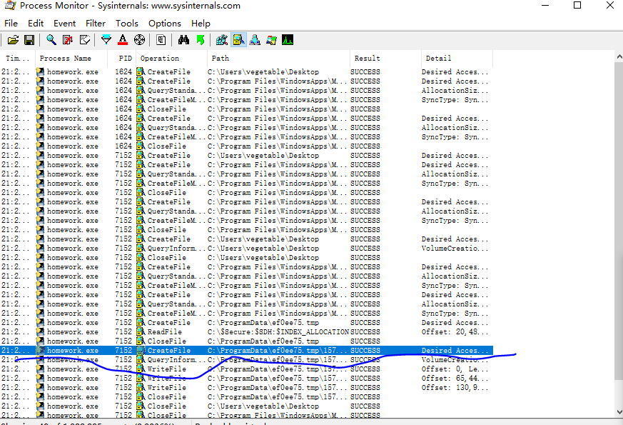
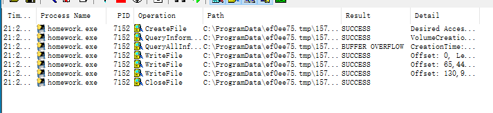
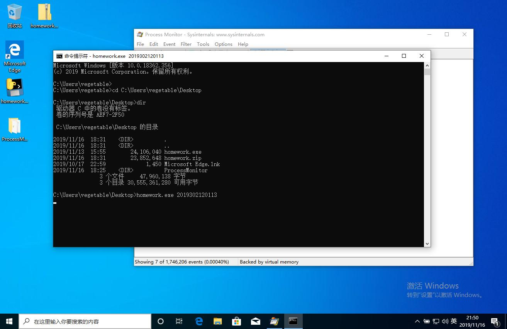

# 使用prosess Monotor 观察 程序的文件操作
### 第一步

1. 虚拟机中打开process monitor.

2. 运行cmd，输入如图所示的代码，tab键可以补全，输入dir检查是否成功。

 

3. 再在cmd中输入homework.exe 运行程序。

### 第二步

1. 打开process monitor，打开filter

2. 添加几个过滤器选项
* process name is homework.exe include 
* path begins with C:\Windows Exclude
* result is success include

* 在软件界面中只选择 show me file system activity 

* 继续设置过滤器    path  contains homework exclude
* path contains C:\Users\vegetable\AppData exclude
  
 就会得到如下结果

3. 点开就可以看到jpg文件的目录了
   

##### 其实还有一种更为简便的过滤方法
* 直接设置过滤器：
* process name homework include
* path ends with jpg include 
 
 
就可直接看到结果了
可看到结果

